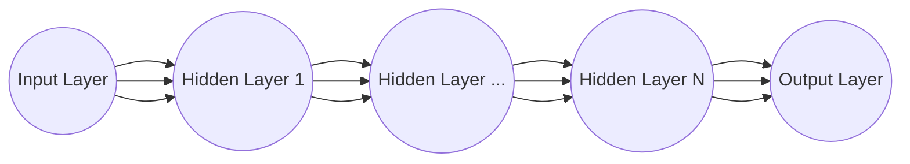

# Redes Neuronales (Artificales)

La idea detrás de las Redes Neuronales Artificiales está en agrupar en distintas capas un conjunto de Neuronas Artificiales (también llamadas Perceptrones), estas capas van a tener distintas funciones según el modelo pero en general tenemos 3 tipos: 

- Input Layer
- Hidden Layer(s)
- Output Layer

Estas capas van a comunicarse entre sí para procesar la información, tomando $N$ inputs (donde $N$ es la cantidad de nodos en la capa anterior) y calculando la suma ponderada con sus respectivos pesos (para cada $N_i$ existe un $W_i$) tal que el resultado de salida de la neurona es:

$$f(N*W + b)$$

Lo que hacemos además es pasar el resultado por una función activadora $f$ que básicamente aplica transformaciones no lineales a la suma ponderada, mas adelante vamos a ver las diferentes funciones que existen y sus usos.

 

