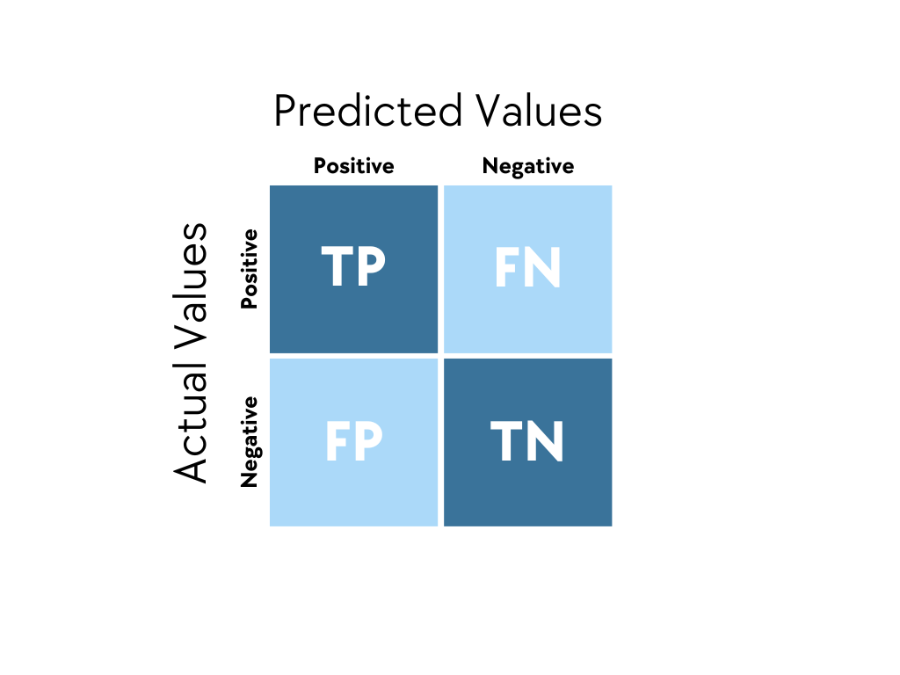

# Evaluación y Validación de Modelos

## Evaluación de Aprendizaje Supervisado
El proceso de evaluacion de un modelo involucra establecer su **precisión de predicción de resultados** y es fundamental para optimizar predicciones y entender la efectividad del mismo. 
 
Como bien sabemos, dentro del aprendizaje supervisado tenemos 2 categorías diferentes a la hora de definir el uso del mismo, *Regresión* y *Clasificación*. Claramente nuestras métricas van a ser diferentes para los casos de regresión vs clasificación, veamos los casos particulares: 

## Métricas en clasificación

Estudiamos la correctitud de las clasificaciones predecidas respecto a su clasificación real.

-   ###   Accuracy

Ratio de instancias predecidas correctamente sobre total de instancias.

$$\text{Accuracy} = \frac{TP + TN}{TP + TN + FP + FN}$$

-   ### Matriz de confusión
Compara asignaciónes realizadas con su asignación real.

-   ### Precision
Cuantas predicciones positivas eran realmente positivas

$$\text{Precision} = \frac{TP}{TP + FP}$$

-   ### Recall
Cuantas instancias positivas fueron correctamente predecidas

$$\text{Recall} = \frac{TP}{TP + FN}$$

-   ### F1
Combina [Precision](#precision) y [Recall](#recall) utilizando su media balanceada.

$$\text{F1} = \frac{2 * Precision * Recall}{Precision + Recall}$$

## Métricas en regresión

Estudiamos la capacidad del modelo de predecir valores continuos con exactitud

-   ### MAE
Mide el promedio absoluto de la diferencia entre el valor actual y el predecido, tiene la ventaja de dar resultados en las unidades de la variable objetivo.

$$\text{MAE} = \frac{1}{n} \sum_{i=1}^{n} |y_i - \hat{y}_i|$$

-   ### MSE
Calcula el promedio de la diferencia de cuadrados entre valores reales y predecidos. Al ser cuadrado hay una mayor penalización por error.

$$\text{MAE} = \frac{1}{n} \sum_{i=1}^{n} (y_i - \hat{y}_i)²$$

-   ### RMSE
Similar a [MSE](#mse), mantiene las penalizaciones fuertes pero convierte el resultado a la unidad original de la variable objetivo.

$$\text{MAE} = \sqrt{\frac{1}{n} \sum_{i=1}^{n} (y_i - \hat{y}_i)²}$$

-   ### R²
Calcula el porcentaje de la variabilidad de la variable objetivo que es explicada por los features.
$$R^2 = 1 - \frac{\sum_{i=1}^{n} (y_i - \hat{y}_i)^2}{\sum_{i=1}^{n} (y_i - \bar{y}_i)^2}$$