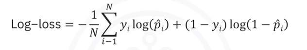
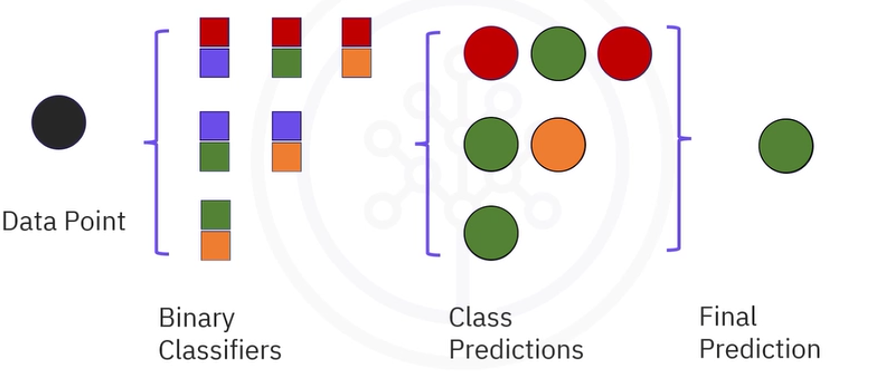

## Regresión Logística

### ¿Para qué sirve?
Se utiliza para predecir la probabilidad de que una observación pertenezca a una de dos clases.  

### Info útil:
En general es importante marcar un "threshold" o limite para diferenciar positivos de negativos (fundamentalmente especificar cuando un decimal probabilistico se redondea a positivo y cuando a negativo), tambien conocido como **limite de decisión**. 

### Como entrenar:
Primero, la métrica que se usa para calcular la efectividad de una predicción individual es una función de costo llamada **pérdida logistica** y buscamos minimizarla.   pérdida logistica mide que tan bien la probabilidad predecida $\hat{p}_i$ matchea con la clase real $y_i$.   Luego vamos a usar el Descenso de Gradiente para encontrar el minimo de la función (repasar)

### Ejemplos de uso:
- Estimar la probabilidad de que un paciente tenga una enfermedad en base a peso, altura, presión arterial.
- Predecir si un usuario va a comprar un producto en base a su edad y salario neto.

### Diferencia con arbol de clasificacion
A diferencia del arbol de clasificacion este es utilizado para predecir valores continuos de una variable objetvio.  
Por ejemplo un arbol de clasificacion se utilizaria para analisis medicos, pertenencia a conjuntos, etc. Mientras que el arbol de regresion se utiliza para predecir temperaturas, indices demograficos, etc.

# Clasificación
**Es la idea de utilizar modelos ya entrenados para clasificar nuevos datos**

## Algoritmos de clasificación

Dentro de los algoritmos mas notorios tenemos Regresión Logística, Arboles de decisión, Redes Neuronales, K-nearest neighbors (KNN).

## Clasificación de multiples clases

No todos los algoritmos sirven para clasificar entre clases multiples (mas allá de clasif. binaria), pero podemos utilizar a aquellos con capacidades binarias para componer algoritmos de clasificación múltiple, para esto tenemos:

-   Uno contra todos: Para cada etiqueta tenemos un clasif. binario y pasamos el datapoint por cada uno.
    - Es azul? (Si no)-> Es verde? (Si no)-> Es rojo? (Si no)-> Es outsider
- Uno contra uno: Tomamos todos los posibles pares de clases y comparamos a cual es mas cercano, luego gana el de mayor acercamiento. (REPASAR)

