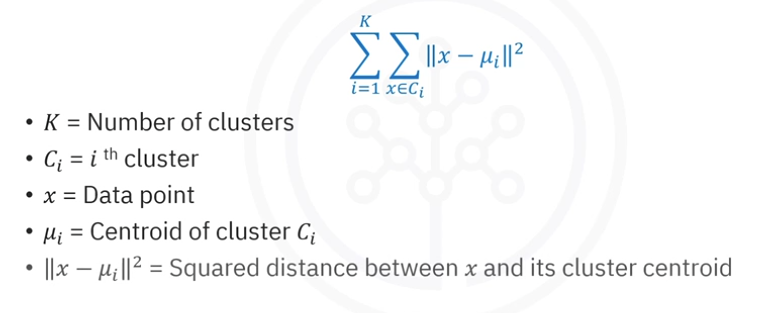

# K-Means

Es un algoritmo de clustering iterativo que se basa en la división de de datapoints en K clusters que minimizan las variaciones de los datos internos y maximiza las diferencias entre clusters. 

## Cuando usar
-   La información es separable
-   Difícil de visualizar (espacios de dimensiones grandes)

## Parametros
El parametro mas importante es K, que define cuando agrupamos en K clusters. Es importante tener en cuenta la siguiente relación respecto a la cantidad que elegimos:
-   K Alto: Clusters mas pequeños con mayor detalle
-   K Bajo: Clusters mas grandes con menor detalle

Notemos que en realidad lo que hacemos es tomar k núcleos para cada agrupamiento y luego simplemente agrupamos cada datapoint al núcleo mas próximo.

## Pseudo-algoritmo

1.  Definimos un valor del K y elegimos los núcleos al azar
2.  Asignar iterativamente puntos a los clusters y actualizar núcleos
3.  Repetir hasta estabilizar núcleos o llegar al tope de la iteración

## Optimización
Buscamos minimizar la suma interna a los clusters de los cuadrados 
 